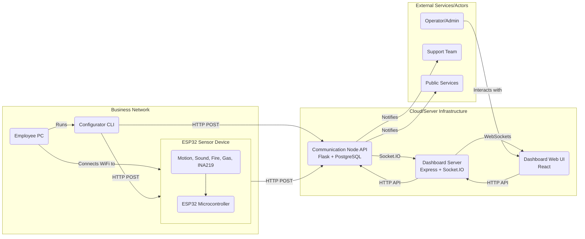
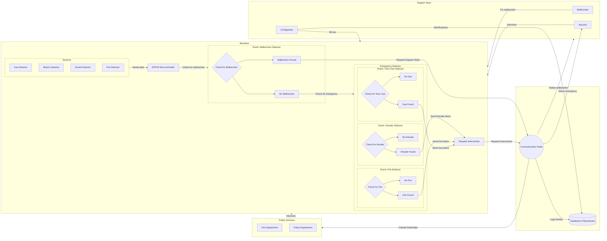
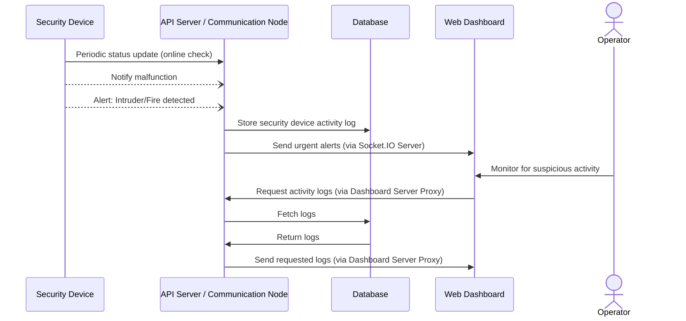

# IoT Emergency Response System

## Overview

This project implements a comprehensive IoT system designed for emergency detection and response within business environments. It utilizes ESP32-based sensor devices deployed on-site to monitor for potential threats like fire, gas leaks, intrusions (motion/sound), and device malfunctions.

Detected events are reported to a central backend (`communication-node`), which stores the data, manages devices, and pushes real-time notifications to a web-based dashboard. The system facilitates monitoring, incident management, and potentially dispatching support or public services.

## System Architecture

The system consists of several key components interacting across different network layers:

*   **ESP32 Sensor Device:** Deployed at the business location, monitors sensors, and sends alerts/logs/malfunctions to the Communication Node.
*   **Communication Node:** The central Flask/Python backend. It receives data from devices and the configurator, stores it in a PostgreSQL database, validates API keys, and forwards real-time events to the Dashboard Server via Socket.IO.
*   **Dashboard Server:** An Express/Node.js server that serves the frontend, acts as a secure API gateway to the Communication Node, and manages WebSocket connections for real-time updates.
*   **Dashboard UI:** A React-based web application for monitoring devices, viewing alerts/logs, managing businesses/employees, and resolving incidents.
*   **Configurator Tool:** A Python CLI tool used by employees/technicians to perform the initial setup and configuration of ESP32 devices.
*   **Device Emulator:** A Python CLI tool for testing the Communication Node API endpoints without needing physical devices or the configurator.

*(See `docs/diagrams/` for more detailed architecture, sequence, and workflow diagrams.)*

## Components

This repository is structured as a monorepo containing the following components:

1.  **[`esp32-software/`](./esp32-software/)**: Firmware for the ESP32 microcontroller written in C using the ESP-IDF framework. Handles sensor reading, malfunction detection (via INA219), Wi-Fi connection, initial configuration via AP mode web server, and secure communication with the `communication-node`.
    *   [ESP32 Software README](./esp32-software/README.md)

2.  **[`communication-node/`](./communication-node/)**: The central backend API server built with Python (Flask) and PostgreSQL. It manages devices, businesses, employees, API keys, ingests data from devices, and pushes updates to the dashboard server.
    *   [Communication Node README](./communication-node/README.md)

3.  **[`dashboard/`](./dashboard/)**: Contains both the frontend web application (React, Vite, TypeScript) and its supporting backend server (Node.js, Express, Socket.IO). The backend serves the UI, proxies API calls to the `communication-node`, and handles real-time WebSocket communication.
    *   [Dashboard README](./dashboard/README.md)

4.  **[`configurator/`](./configurator/)**: A command-line interface (CLI) tool written in Python. Used by technicians to configure new ESP32 devices by connecting to their AP mode, gathering settings, generating an API key, registering the device with the `communication-node`, and sending the configuration to the device.
    *   [Configurator README](./configurator/README.md)

5.  **[`gui-configurator/`](./gui-configurator/)**: A graphical user interface (GUI) alternative to the command-line configurator, built with Python and Tkinter. Provides a more user-friendly way to configure ESP32 devices with the same functionality as the CLI version.
    *   [GUI Configurator README](./gui-configurator/README.md)

6.  **[`device-emulator/`](./device-emulator/)**: A CLI tool written in Python to emulate API calls from both the ESP32 devices and the configurator tool. Useful for testing the `communication-node` endpoints independently.
    *   [Device Emulator README](./device-emulator/README.md)

7.  **[`gui-device-emulator/`](./gui-device-emulator/)**: A graphical user interface (GUI) alternative to the command-line device emulator, built with Python and Tkinter. Provides a more intuitive way to test and debug API endpoints with real-time request/response logging.
    *   [GUI Device Emulator README](./gui-device-emulator/README.md)

8.  **[`docs/`](./docs/)**: Contains documentation, including Mermaid diagrams illustrating system architecture and workflows.

## Features

*   **Multi-Sensor Monitoring:** Detects motion, sound, fire, and gas.
*   **Malfunction Detection:** Monitors sensor power consumption (INA219) to detect hardware issues.
*   **Real-time Dashboard:** Web interface with live updates for alerts, malfunctions, and logs.
*   **Data Visualization:** Map view of business locations, charts for statistics.
*   **Device Management:** Register, configure, and potentially manage devices via the system.
*   **Business/Employee Management:** Basic CRUD operations for businesses and employees via the dashboard.
*   **API Key Authentication:** Secure communication between components using API keys with defined access levels.
*   **Persistent Storage:** Uses PostgreSQL for reliable data storage.
*   **Simplified Setup:** Includes a dedicated CLI tool (`configurator`) for initial device provisioning.
*   **Testability:** Includes a device emulator for backend testing.

## Technology Stack

*   **Hardware:** ESP32, Various Sensors (PIR, Sound, Flame, Gas, INA219)
*   **Firmware:** C, ESP-IDF
*   **Backend (Communication Node):** Python, Flask, PostgreSQL, psycopg2, python-dotenv, python-socketio (client)
*   **Frontend/Real-time Server (Dashboard):** Node.js, TypeScript, Express, Socket.IO, React, Vite, Tailwind CSS, Axios, React Query, Chart.js, Leaflet
*   **Tooling:** Python (for Configurator & Emulator), Git, Docker (potentially for deployment - not specified but common)

## Setup and Installation

Setting up the full system involves multiple steps across the different components. Please refer to the individual README files for detailed instructions. The general order is:

1.  **Set up PostgreSQL:** Install and configure a PostgreSQL database server.
2.  **Set up `communication-node`:**
    *   Install Python dependencies (`pip install -r requirements.txt`).
    *   Configure `.env` with database credentials and dashboard server details.
    *   Initialize the database schema (`python setup/init_db.py`).
    *   Generate necessary API keys (`python setup/generate_api_key.py`).
    *   Run the Flask server (`python app.py`).
    *   [Communication Node README](./communication-node/README.md)
3.  **Set up `dashboard`:**
    *   Install Node.js dependencies (`npm install`).
    *   Configure `.env` with communication node details, API key, and its own server settings.
    *   Build the frontend (`npm run build`).
    *   Run the Express/Socket.IO server (`npm start` or `npm run dev` for development).
    *   [Dashboard README](./dashboard/README.md)
4.  **Set up `esp32-software`:**
    *   Install ESP-IDF.
    *   Optionally modify hardcoded backend IP in `components/utils/utils.c` if not using default.
    *   Build and flash the firmware onto an ESP32 device (`idf.py build flash monitor`).
    *   [ESP32 Software README](./esp32-software/README.md)
5.  **Configure ESP32 Device using `configurator`:**
    *   Install Python dependencies (`pip install -r requirements.txt`).
    *   Connect your PC to the ESP32's Wi-Fi AP.
    *   Run the configurator (`python main.py`), providing the communication node URL, a Level 1 API key, and following the prompts.
    *   [Configurator README](./configurator/README.md)

## Usage

1.  **Configuration:** Use the `configurator` or `gui-configurator` tool to set up new ESP32 devices.
2.  **Monitoring:** Access the `dashboard` web application URL in a browser. Log in (authentication mechanism for dashboard users TBD/not specified in READMEs) or use an admin API key.
3.  **Dashboard:** View the status of businesses and devices, monitor incoming alerts and malfunctions in real-time, view historical logs, and manage entities.
4.  **Testing:** Use the `device-emulator` or `gui-device-emulator` tool to manually send test events to the `communication-node` API.

## Diagrams

More detailed diagrams can be found in the [`docs/diagrams/`](./docs/diagrams/) folder.

### System Workflow

### Communication Sequence

